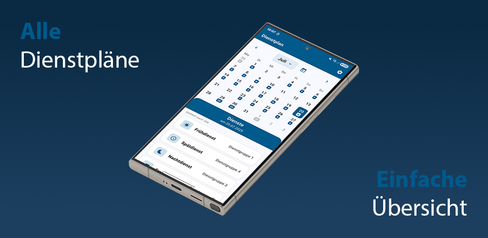

# 📅 Dienstplan - Police Duty Schedule App

[](https://flutter.dev)
[](LICENSE)
[](https://github.com/lusu007/dienstplan)
[](https://github.com/lusu007/dienstplan/releases)



A modern, cross-platform mobile application designed specifically for police officers to manage and view their duty schedules. Built with Flutter using clean architecture principles for optimal performance and maintainability.

---

## 🚀 Features

### 📱 Core Functionality
- **📅 Interactive Calendar**: Easy-to-use calendar with month and year picker for quick navigation to any date
- **👥 Personal Duty Group**: Set your preferred duty group for personalized schedule views
- **🔄 Works Offline**: No internet connection required - all data stored on your device
- **⚡ Fast Loading**: Quick access to your schedule with optimized performance
- **🌍 German Language**: Full German localization for native users
- **📊 Multiple Schedules**: Switch between different duty schedule types (e.g., Bereitschaftspolizei, ESD)

### 🛠 Advanced Features
- **🎯 Smart Schedule Generation**: Automatically generates your schedule based on rotation patterns
- **📋 Detailed Duty Information**: Tap any date to see your specific duty details and times
- **🔧 Flexible Duty Types**: Support for various duty types like Frühdienst, Spätdienst, Nachtdienst, and special assignments
- **📱 Modern Interface**: Clean, intuitive design that's easy to navigate
- **🔄 Remember Your Settings**: App remembers your preferences, selected dates, and duty group
- **📊 Filter Your View**: Filter schedules by duty group to focus on your assignments

### 🔒 Privacy & Security
- **🔐 Your Data Stays Private**: All schedule data stored locally on your device
- **🚫 No Cloud Sync**: Your personal schedule information never leaves your device
- **📊 Optional Error Reporting**: Help improve the app with optional error reporting (can be turned off)
- **🔒 Complete Privacy**: No personal data collection or tracking

### 🏗 Technical Features
- **Clean Architecture**: Separation of concerns with domain, data, and presentation layers
- **Dependency Injection**: Riverpod-based providers for testable and composable components
- **State Management**: Riverpod (AsyncNotifier/codegen) with Freezed unions for robust UI states
- **Database Migration**: Automatic schema updates with user notifications
- **Error Handling**: Comprehensive error tracking and user-friendly error messages

---

## 📦 Installation

### From App Store
- **Direct APK**: Available in [GitHub Releases](https://github.com/lusu007/dienstplan/releases)

### From Source
```bash
# Clone the repository
git clone https://github.com/lusu007/dienstplan.git
cd dienstplan

# Install dependencies
flutter pub get

# Run the app
flutter run

# Build for production
flutter build apk --release
```

For detailed development setup and workflow, see [CONTRIBUTING.md](CONTRIBUTING.md).

---

## 🏗 Architecture

### Project Structure
```
lib/
├── core/                    # Core utilities and services
│   ├── di/                 # Dependency injection
│   ├── initialization/     # App initialization
│   ├── services/          # Core services
│   ├── utils/             # Utilities and helpers
│   └── cache/             # Caching mechanisms
├── data/                   # Data layer
│   ├── data_sources/      # Data sources (local, remote)
│   ├── models/            # Data models
│   ├── repositories/      # Repository implementations
│   └── services/          # Data services
├── domain/                 # Domain layer
│   ├── entities/          # Business entities
│   ├── use_cases/         # Business logic use cases
│   └── repositories/      # Repository interfaces
└── presentation/           # Presentation layer
    ├── controllers/       # State management controllers
    ├── screens/           # UI screens
    └── widgets/           # Reusable UI components
```

### Riverpod Dependency Injection
- **No GetIt**: The app does not use GetIt. DI is handled via Riverpod providers.
- **Providers**: Defined in `lib/core/di/riverpod_providers.dart` and generated into `lib/core/di/riverpod_providers.g.dart`.
- **KeepAlive**: Long-lived services (e.g., `databaseService`, `languageService`, `sentryService`, `scheduleConfigService`) are marked with `@Riverpod(keepAlive: true)` to avoid re-initialization between screens.
- **Usage**: Consumers access dependencies via `ref.read(someProvider)` / `ref.watch(someProvider)` (or `.future` for async providers).

### App Startup Path
- Entry point: `lib/main.dart`
- Bootstrap: `AppInitializer.initialize()` creates a shared `ProviderContainer`, warms critical services, and returns the container.
- Sentry: Initialized via `AppInitializer.initializeSentry(...)` before `runApp`.
- Root widget: `presentation/app.dart` wrapped in `UncontrolledProviderScope` using the prebuilt container.

### Schedule Configuration Format
Duty schedules are defined using JSON configuration files in `assets/schedules/`. The format supports comprehensive schedule management.

#### Configuration Elements

##### **Metadata (`meta`)**
- **`name`**: Display name for the schedule configuration
- **`created_by`**: Author of the schedule
- **`description`**: Detailed description of the schedule
- **`start_week_day`**: First day of the week (e.g., "Monday")
- **`start_date`**: Reference date for schedule calculations
- **`days`**: Array of day abbreviations
- **`icon`**: Icon identifier for visual representation

##### **Duty Types (`duty_types`)**
- **`id`**: Short identifier (e.g., "F", "S", "N")
- **`label`**: Human-readable name
- **`all_day`**: Optional flag for all-day duties
- **`icon`**: Optional icon identifier for visual representation

##### **Duty Type Order (`duty_type_order`)**
- Defines the display order of duty types in the UI
- Controls sorting and grouping of duties

##### **Rhythms (`rhythms`)**
- **`length_weeks`**: Duration of the rotation cycle
- **`pattern`**: Array of weekly patterns
- **`pattern[week][day]`**: Duty type for each day of each week

##### **Duty Groups (`dienstgruppen`)**
- **`id`**: Unique identifier for the group
- **`name`**: Display name
- **`rhythm`**: Reference to rhythm configuration
- **`offset_weeks`**: Week offset from the start date

#### Icons
The `icon` field supports various Material Design icon names. For a complete list of available icons, see [`lib/core/utils/icon_mapper.dart`](lib/core/utils/icon_mapper.dart). If no icon is specified or an invalid icon name is used, a default schedule icon will be displayed.

---

## 🛠 Development

### Prerequisites
- Flutter SDK 3.2.3 or higher
- Dart SDK 3.2.3 or higher
- Android Studio / VS Code
- Git

### Setup
```bash
# Clone the repository
git clone https://github.com/lusu007/dienstplan.git
cd dienstplan

# Install dependencies
flutter pub get

# Run the app
flutter run

# Run tests
flutter test

# Build for production
flutter build apk --release
```

### Key Dependencies
- **State Management**: `flutter_riverpod: ^2.6.1`, `riverpod_annotation: ^2.6.1`, `freezed_annotation: ^3.1.0`
- **Dependency Injection**: via Riverpod providers (no separate service locator)
- **Database**: `sqflite: ^2.4.2`
- **Calendar**: `table_calendar: ^3.2.0`
- **Localization**: `flutter_localizations`
- **Error Tracking**: `sentry_flutter: ^9.6.0`

### Architecture Patterns
- **Clean Architecture**: Separation of concerns with clear layer boundaries
- **Repository Pattern**: Abstract data access with concrete implementations
- **Use Case Pattern**: Business logic encapsulation
- **Riverpod**: State management and dependency injection via providers
- **Dependency Injection**: Implemented with Riverpod providers (no service locator)

---

## 🤝 Contributing

We welcome contributions! Please see our [Contributing Guidelines](CONTRIBUTING.md) for detailed information on:

- 🚀 Development setup and workflow
- 📝 Code standards and best practices
- 🧪 Testing guidelines
- 📋 Pull request process
- 🐛 Issue reporting
- 🏗 Project structure and architecture

### Quick Start
1. **Fork the repository**
2. **Create a feature branch**: `git checkout -b feature/your-feature`
3. **Make your changes** following our coding standards
4. **Test thoroughly** with `flutter test`
5. **Submit a pull request** with a clear description

For questions and discussions, please use [GitHub Discussions](https://github.com/lusu007/dienstplan/discussions).

---

## 📄 License

This project is licensed under the **GNU Affero General Public License v3.0 (AGPL-3.0)**.

### License Summary
✅ **You may**:
- View, study, and modify the source code
- Compile and run the application for personal use
- Distribute modified versions with source code

❌ **You may not**:
- Use in closed-source projects without publishing source
- Remove or alter license notices
- Distribute compiled versions commercially without permission

### Commercial Use
- **Source code**: Open source under AGPL-3.0
- **Compiled app**: Available commercially in app stores
- **Personal builds**: Allowed for personal use

---

## 📞 Support

### Getting Help
- **GitHub Issues**: [Report bugs or request features](https://github.com/lusu007/dienstplan/issues)
- **Documentation**: Check the code comments and this README
- **Community**: Join discussions in GitHub Discussions

---

**Built with ❤️ for police officers in Germany**
