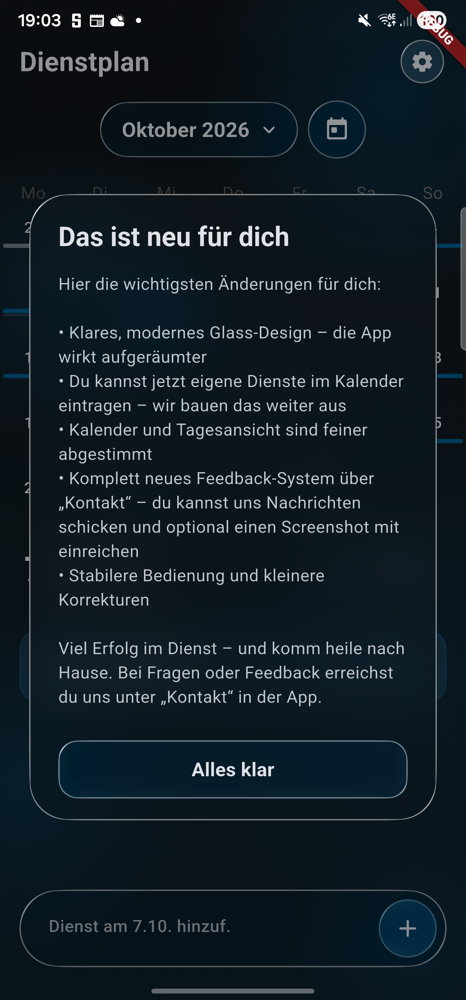
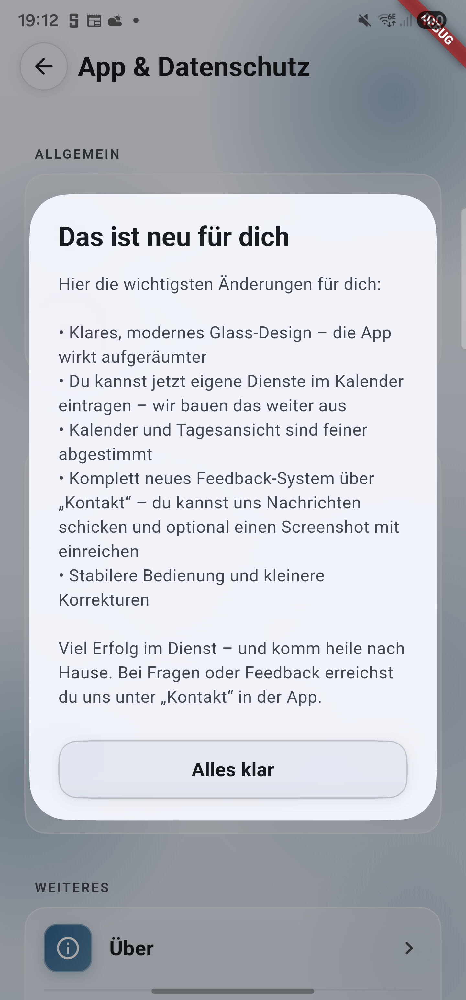
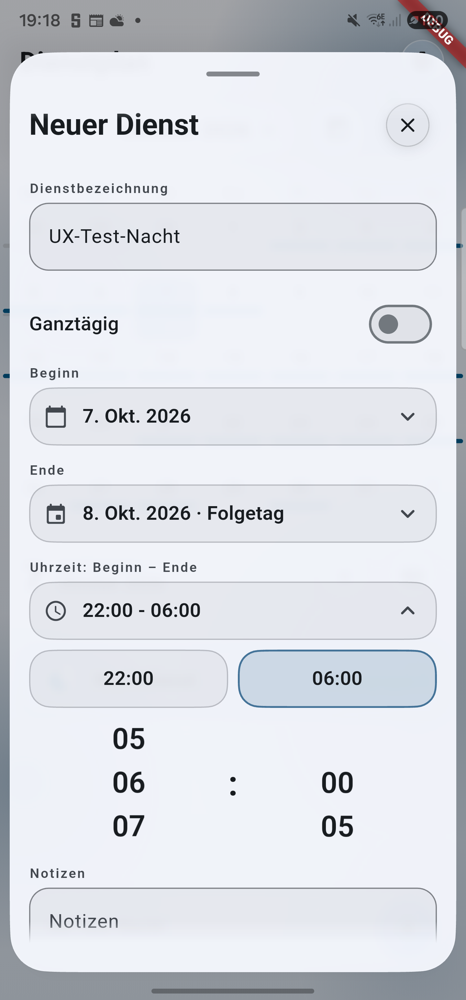

# UI-/UX-Audit: Abnahme des Hauptpakets

Stand: 7. Oktober 2026. Geprüfter Code: `fe21993`, Basis `main` bei `8aed03a`. Android-Dev-Build **0.17.4 (4011)** auf Samsung Galaxy S22 Ultra installiert. Keine Abhängigkeitsupdates.

## Automatisierte Prüfung

Mit Flutter 3.47.6 und dem zugehörigen Dart:

| Prüfung | Ergebnis |
| --- | --- |
| `flutter analyze` | Keine Befunde |
| `flutter test` | 322 Tests bestanden |
| `git diff --check` | Keine Fehler |
| `flutter build apk --debug --flavor dev --target-platform android-arm64 --build-number=4011` | Erfolgreich |

Die Suite enthält 120 Layoutfälle: zehn Oberflächen (fünf Setup-Schritte, Kalenderkopf, Feedback mit Anhang, Einstellungen, Disclaimer, Datenschutz) × Hell/Dunkel × 320×640/740×360 × Textskalierung 1,0/1,5/2,0. Sie prüft Überläufe und die Erreichbarkeit der jeweils letzten Aktion. Die Setup-Prüfung nutzt Fakes und setzt keine persönlichen Gerätedaten zurück.

Weitere Regressionen prüfen Fehler statt falscher Leerzustände, behalten passende eigene Dienste bei Partnerfehlern, laden beim Wiederholen den entfernten Fokusbereich erneut und erhalten Provider während asynchroner Vorgänge. Formularprüfungen decken Schnelleingabe per Plus/Tastatur, Erfolg statt Abbruch als Voraussetzung für das Leeren, Außenklick/Zurück/Griff-Wischen, Doppelspeichern und erhaltene Eingaben nach Speicherfehlern ab.

Nachtdienste und freie Enddaten werden über Mapper, Validierung, DAO und Widgets geprüft, einschließlich Jahreswechsel, Schaltjahr, Sommerzeit-Grenzdatum, manueller Endtag-Auswahl und direktem Wechsel zwischen Beginn-/Enddatum-Picker. Die SQLite-Migration erhält bestehende Einträge sowohl ohne Enddatum-Spalte als auch bei der auf dem Gerät gefundenen Version 19 mit bereits vorhandener Spalte. Der Test nutzt SQLite über Python hinter dem sqflite-Testkanal; er prüft Schema und Daten, keinen plattformübergreifenden Transaktions-Rollback.

Feedbackprüfungen decken Abbruch, Android-Zurück, fehlgeschlagene Aufnahme mit vorherigem Anhang sowie das Entfernen der zugrunde liegenden Route ab. Resetprüfungen benutzen ausschließlich Fakes: einmalige Löschung bei Doppeltippen, gesperrtes Zurück während der Aktion, Speicher-/Einstellungs-/Abhängigkeitsfehler, erfolgreiche Wiederholung und genau eine Setup-Navigation.

## Geräteprüfung

- Aktualisierung ohne App-Reset; bestehende Dienstplan-Auswahl und persönliche Einträge bleiben erhalten. Die zuvor fehlgeschlagene Datenbankmigration läuft erfolgreich auf Version 20.
- „Das ist neu für dich“: Button und Text im System-Dark-Theme sowie im hellen Theme lesbar; Dialog lässt sich schließen.
- Kalender zeigt die eigenen Dienste. Schnelleingabe übernimmt den Titel in „Neuer Dienst“.
- Dienst 22:00–06:00: konkretes Enddatum mit „Folgetag“; Speichern und erneutes Öffnen kontrolliert. Ausschließlich der neu erzeugte Testeintrag wird danach entfernt.
- Veränderten Dienstentwurf verlassen: „Weiter bearbeiten“/„Verwerfen“; Fortsetzen erhält die Zeiten. Tastatur-Schließen und Zurück getrennt geprüft.
- Feedbacktext eingeben, Screenshot-Auswahl starten, „Abbrechen“: derselbe Text kehrt zurück; Zurück fragt vor dem Verwerfen. Keine Nachricht versendet.
- Reset-Dialog öffnen und abbrechen; keinen tatsächlichen Reset ausgeführt.
- Helles Feedbackformular mit System-Schriftgröße 1,5 kontrolliert. Die ursprüngliche Schriftgröße 1,0, automatische Drehung und die effektive System-Theme-Auswahl sind wiederhergestellt. Der abschließende Vergleich bestätigt identische fachliche Einstellungen und ursprüngliche persönliche IDs; nur interne Settings-Zeilenmetadaten und die bestätigte Update-Version ändern sich.

Das Gerät bleibt aufgrund der bestehenden App-Regel für Displays unter 600 dp im Hochformat. Querformat ist über die Widgetmatrix abgedeckt. Setup wurde am Gerät nicht durch einen Reset erzwungen. Exportversand, tatsächlicher Reset, produktiver Feedbackversand und TalkBack sind keine Geräte-Abnahmeschritte dieses Pakets.

## Screenshots

Die Kontrastbilder stammen aus Builds 4008/4009; die entsprechenden Dialoge sind in Build 4011 unverändert. Die Nachtdienst-Auswahl stammt aus Build 4010; die Formularoberfläche ist in Build 4011 unverändert. Die Bilder enthalten nur die allgemeinen Aktualisierungshinweise bzw. den eigens angelegten Testentwurf.

| Dunkler Aktualisierungsdialog | Heller Aktualisierungsdialog |
| --- | --- |
|  |  |

## Review und Restumfang

Die unabhängige Abschlussprüfung meldete drei wichtige Randfälle: Wiederholen eines entfernten Monats, unsichtbare Partner-Ladefehler und ein Overlay nach Entfernen der Screenshot-Hostroute. Alle drei sind mit Regressionstests korrigiert. Zusätzlich sind der Zustand des Datumspickers beim Beginn-/Ende-Wechsel, die idempotente Migration, Griff-Wischen und die Provider-Lebensdauer beim Reset abgesichert.

Auditpunkt 7 (kompakte Dienstkürzel/Semantik und sichtbarer Ansichtsumschalter, Planaufgabe 9) bleibt auf ausdrücklichen Wunsch ein getrenntes Folgepaket. Das Hauptpaket umfasst Planaufgaben 1–8. Mehrtägige Dienste bleiben im Kalender dem Starttag zugeordnet; eine neue Belegungsdarstellung gehört nicht zu diesem Paket. Reset ist weiterhin keine atomare Transaktion über SQLite und Preferences.
